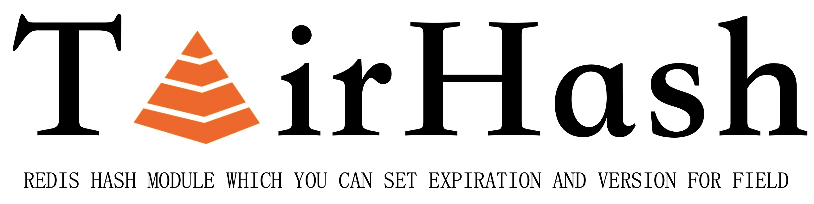
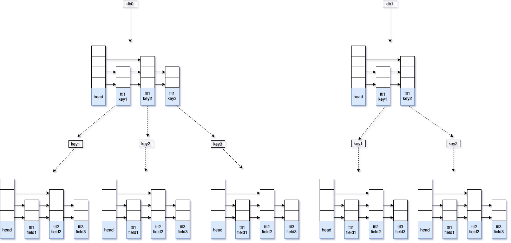

# TairHash: field带有过期时间和版本的hash数据结构
## 简介  [英文说明](README.md)
     TairHash是基于redis module开发的一种hash数据结构，和redis原生的hash数据结构相比，TairHash不但和原生hash一样具有丰富的数据接口和高性能，还可以为field设置过期时间和版本，这极大的提高了hash数据结构的灵活性，在很多场景下可以大大的简化业务开发。TairHash提供active expire机制，即使field在过期后没有被访问也可以被主动删除，释放内存。


### 主要的特性如下：

- field支持单独设置expire和version
- 针对field支持高效的active expire和passivity expire，其中active expire支持SORT_MODE和SCAN_MODE两种模式。
- 语法和原生hash数据类型类似
- 低内存占用，索引中无内存拷贝
- 支持filed过期删除事件通知（基于pubsub）

## 主动过期
### SORT_MODE（排序模式）：



- 使用两级排序索引，第一级对tairhash主key进行排序，第二级针对每个tairhash内部的field进行排序
- 第一级排序使用第二级排序里最小的ttl进行排序，因此主key是按照ttl全局有序的
- 内置定时器会周期扫描第一级索引，找出一部分已经过期的key，然后分别再检查这些key的二级索引，进行field的淘汰，也就是active expire
- 每一次对tairhash的写操作，也会先检查第一级索引，并最多过期三个field，这些field不一定属于当前正在操作的key，因此理论上写的越快淘汰速度也就越快
- 每一次读写field，也会触发对这个field自身的过期淘汰操作
- 排序中所有的key和field都是指针引用，无内存拷贝，无内存膨胀问题

**支持的redis版本**: redis >= 7.0和unstable分支    
**优点**：过期淘汰效率比较高    
**缺点**：由于SORT_MODE实现依赖`unlink2`回调函数(见这个[PR](https://github.com/redis/redis/pull/8999)))同步释放索引结构，因此需要较高的redis版本支持。

**使用方式**：cmake的时候加上`-DSORT_MODE=yes`选项，并重新编译
### SCAN_MODE（扫描模式）：
- 不对TairHash进行全局排序
- 每个TairHash内部依然会使用一个排序索引对fields进行排序
- 内置定时器会周期使用SCAN命令找到包含过期field的TairHash，然后检查TairHash内部的排序索引，进行field的淘汰
- 每一次读写field，也会触发对这个field自身的过期淘汰操作
- 排序中所有的key和field都是指针引用，无内存拷贝，无内存膨胀问题

**支持的redis版本**: redis >= 5.0  
**优点**：可以运行在低版本的redis中（redis >= 5.0 ）      
**缺点**：过期淘汰效率较低（相对SORT模式而言）  

**使用方式**：cmake的时候加上`-DSORT_MODE=no`选项，并重新编译

## 事件通知  

tairhash在field发生过期时（由主动或被动过期触发）会发送一个事件通知，通知以pubsub方式发送，channel的格式为：`tairhash@<db>@<key>__:<event>` , 目前只支持expired事件类型，因此
channel为：`tairhash@<db>@<key>__:expired`，消息内容为过期的field。

## 快速开始

```go
127.0.0.1:6379> EXHSET k f v ex 10
(integer) 1
127.0.0.1:6379> EXHGET k f
"v"
127.0.0.1:6379> EXISTS k
(integer) 1
127.0.0.1:6379> debug sleep 10
OK
(10.00s)
127.0.0.1:6379> EXISTS k
(integer) 0
127.0.0.1:6379> EXHGET k f
(nil)
127.0.0.1:6379> EXHSET k f v px 10000
(integer) 1
127.0.0.1:6379> EXHGET k f
"v"
127.0.0.1:6379> EXISTS k
(integer) 1
127.0.0.1:6379> debug sleep 10
OK
(10.00s)
127.0.0.1:6379> EXISTS k
(integer) 0
127.0.0.1:6379> EXHGET k f
(nil)
127.0.0.1:6379> EXHSET k f v  VER 1
(integer) 1
127.0.0.1:6379> EXHSET k f v  VER 1
(integer) 0
127.0.0.1:6379> EXHSET k f v  VER 1
(error) ERR update version is stale
127.0.0.1:6379> EXHSET k f v  ABS 1
(integer) 0
127.0.0.1:6379> EXHSET k f v  ABS 2
(integer) 0
127.0.0.1:6379> EXHVER k f
(integer) 2
```  
## 编译及使用

```
mkdir build  
cd build  
cmake ../ && make -j
```
编译成功后会在lib目录下产生tairhash_module.so库文件

```
./redis-server --loadmodule /path/to/tairhash_module.so
```  
## 测试方法

1. 修改`tests`目录下tairhash.tcl文件中的路径为`set testmodule [file your_path/tairhash_module.so]`
2. 将`tests`目录下tairhash.tcl文件路径加入到redis的test_helper.tcl的all_tests中
3. 在redis根目录下运行./runtest --single tairhash

## 客户端
### Java : https://github.com/aliyun/alibabacloud-tairjedis-sdk
### 其他语言：可以参考java的sendcommand自己封装

## API
[参考这里](CMDDOC-CN.md)

## 我们的modules

[TairHash](https://github.com/alibaba/TairHash): 和redis hash类似，但是可以为field设置expire和version，支持高效的主动过期和被动过期   
[TairZset](https://github.com/alibaba/TairZset): 和redis zset类似，但是支持多（最大255）维排序，同时支持incrby语义，非常适合游戏排行榜场景   
[TairString](https://github.com/alibaba/TairString): 和redis string类似，但是支持设置expire和version，并提供CAS/CAD等实用命令，非常适用于分布式锁等场景  


