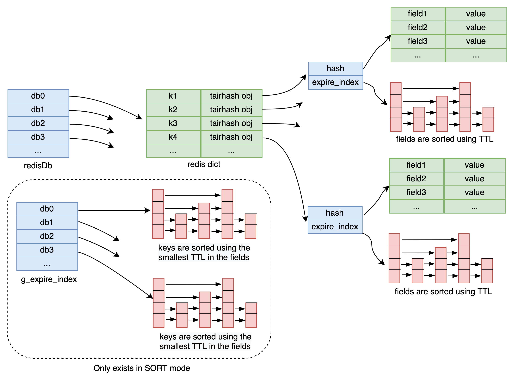
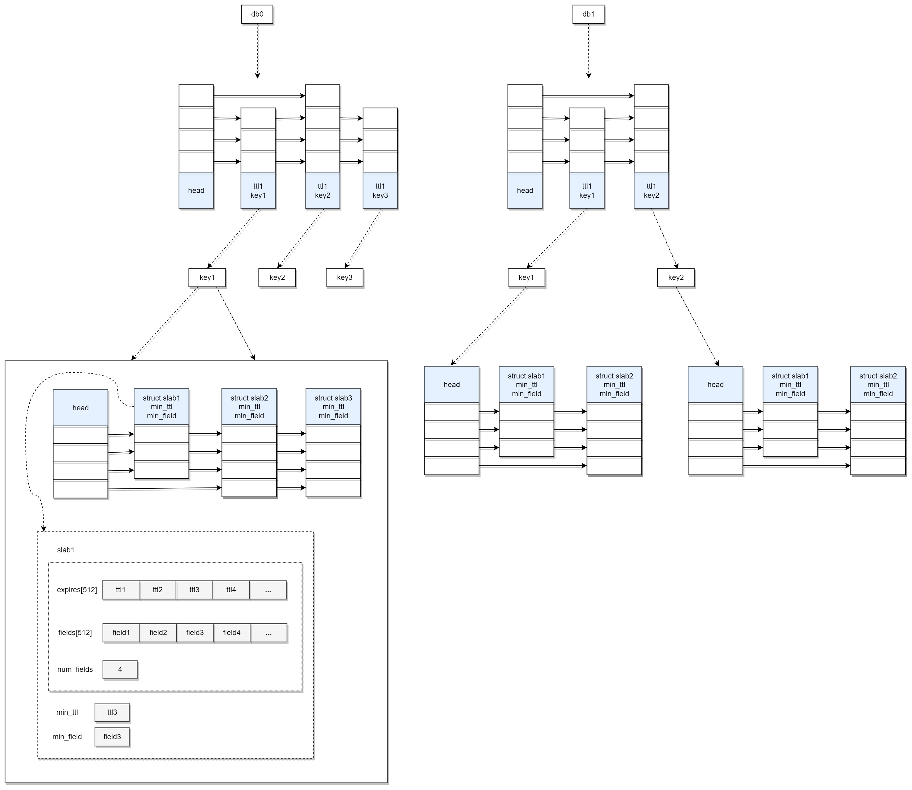

[](https://github.com/alibaba/TairHash/actions/workflows/cmake.yml)
[](https://github.com/alibaba/TairHash/actions/workflows/ci.yml)
[](https://github.com/alibaba/TairHash/actions/workflows/docker-image.yml)
[](https://codecov.io/gh/chenyang8094/TairHash)  


<div align=center>

</div>
   

## Introduction  [中文说明](README-CN.md)
     TairHash is a hash data structure developed based on the redis module. TairHash not only has the same rich data interface and high performance as the native hash, but also can set the expiration and version for the field. TairHash provides an active expiration mechanism, even if the field is not accessed after expiration, it can be actively deleted to release the memory.


### The main features：

- Field supports setting expiration and version
- Support efficient active expiration (SORT mode and SCAN mode) and passivity expiration for field
- The cmd is similar to the redis hash
- Very low memory consumption, no memory copy in the index
- Support field expired event notification (based on pubsub)

## Data structure
  
## Active expiration
### SORT_MODE：
- Use a two-level sort index, the first level sorts the main key of tairhash, and the second level sorts the fields inside each tairhash
- The first-level uses the smallest ttl in the second-level for sorting, so the main key is globally ordered
- The built-in timer will periodically scan the first-level index to find out a key that has expired, and then check the secondary index of these keys to eliminate the expired fields. This is the active expire
- Every time a write operation to tairhash, the first level index will be checked first, and at most three fields will be expired, Note these fields may not belong to the key currently being operated, so in theory, the faster you write, the faster the elimination
- Every time you read or write a field, it will also trigger the expiration of the field itself
- All keys and fields in the sorting index are pointer references, no memory copy, no memory expansion problem

**Supported redis version**: redis >= 7.0

**Advantages**: higher efficiency of expire elimination     

**Disadvantages**: Because the SORT_MODE implementation relies on the `unlink2` callback function (see this [PR](https://github.com/redis/redis/pull/8999))) to release the index structure synchronously, So currently only supports redis >= 7.0 and unstable branch  

**Usag**e: cmake with `-DSORT_MODE=yes` option, and recompile

### SLAB_MODE（slab模式）：



- Slab mode is a low memory usage, cache-friendly, high-performance expiration algorithm
- Use a two-level sort index, the first level sorts the main key of tairhash, and the second level sorts globally (between slabs) and locally (within slab) order for each field inside tairhash
- The first level of sorting uses the smallest ttl in the second level of sorting, so the main key is globally ordered according to ttl
- Second level interval ordering, reduces memory bloat, and is friendly to memory operations, using merge nodes to ensure high memory utilization when deleting
- The built-in timer will periodically scan the first-level index to find out a key that has expired,and then check the secondary index of these keys to eliminate the expired fields.and accelerate the elimination rate through prefetching and vectorization technology.This is the active expire
- Every time you read or write a field, it will also trigger the expiration of the field itself
- All keys and fields in the sorting index are pointer references, no memory copy, no memory expansion problem

**Supported redis version**: redis >= 7.0
**Advantages**: Efficient elimination, low memory consumption, and fast access bring new ideas to expiration algorithms      
**Disadvantages**: Because the SORT_MODE implementation relies on the `unlink2` callback function (see this [PR](https://github.com/redis/redis/pull/8999))) to release the index structure synchronously, So currently only supports redis >= 7.0 and unstable branch  

**Usage**: cmake with `-DSLAB_MODE=yes` option, and recompile
### SCAN_MODE(default):
- Do not sort TairHash globally
- Each TairHash will still use a sort index to sort the fields internally
- The built-in timer will periodically use the SCAN command to find the TairHash that contains the expired field, and then check the sort index inside the TairHash to eliminate the field
- Every time you read or write a field, it will also trigger the expiration of the field itself
- All keys and fields in the sorting index are pointer references, no memory copy, no memory expansion problem

**Supported redis version**: redis >= 5.0

**Advantages**: can run in the low version of redis (redis >= 5.0)  

**Disadvantages**: low efficiency of expire elimination (compared with SORT mode)  

**Usage**: cmake with `-DSORT_MODE=no` option, and recompile

## Event notification   

tairhash will send an event notification when the field expires (triggered by active or passive expiration). The notification is sent in pubsub mode. The format of the channel is: `tairhash@<db>@<key>__:<event>` , currently only supports expired event type, so
The channel is: `tairhash@<db>@<key>__:expired`, and the message content is the expired field.

## Quick Start

```go
127.0.0.1:6379> EXHSET k f v ex 10
(integer) 1
127.0.0.1:6379> EXHGET k f
"v"
127.0.0.1:6379> EXISTS k
(integer) 1
127.0.0.1:6379> debug sleep 10
OK
(10.00s)
127.0.0.1:6379> EXISTS k
(integer) 0
127.0.0.1:6379> EXHGET k f
(nil)
127.0.0.1:6379> EXHSET k f v px 10000
(integer) 1
127.0.0.1:6379> EXHGET k f
"v"
127.0.0.1:6379> EXISTS k
(integer) 1
127.0.0.1:6379> debug sleep 10
OK
(10.00s)
127.0.0.1:6379> EXISTS k
(integer) 0
127.0.0.1:6379> EXHGET k f
(nil)
127.0.0.1:6379> EXHSET k f v  VER 1
(integer) 1
127.0.0.1:6379> EXHSET k f v  VER 1
(integer) 0
127.0.0.1:6379> EXHSET k f v  VER 1
(error) ERR update version is stale
127.0.0.1:6379> EXHSET k f v  ABS 1
(integer) 0
127.0.0.1:6379> EXHSET k f v  ABS 2
(integer) 0
127.0.0.1:6379> EXHVER k f
(integer) 2
```  

## Docker
```
docker run -p 6379:6379 tairmodule/tairhash:latest
```
## BUILD

```
mkdir build  
cd build  
cmake ../ && make -j
```
then the tairhash_module.so library file will be generated in the lib directory

```
./redis-server --loadmodule /path/to/tairhash_module.so
```  
## TEST

1. Modify the path in the tairhash.tcl file in the `tests` directory to `set testmodule [file your_path/tairhash_module.so]`
2. Add the path of the tairhash.tcl file in the `tests` directory to the all_tests of redis test_helper.tcl
3. run ./runtest --single tairhash


## Client

| language | GitHub |
|----------|---|
| Java     |https://github.com/alibaba/alibabacloud-tairjedis-sdk|
| Python   |https://github.com/alibaba/tair-py|
| Go       |https://github.com/alibaba/tair-go|
| .Net     |https://github.com/alibaba/AlibabaCloud.TairSDK|

## API
[Reference](CMDDOC.md)


### Our modules
[TairHash](https://github.com/alibaba/TairHash): A redis module, similar to redis hash, but you can set expire and version for the field  
[TairZset](https://github.com/alibaba/TairZset): A redis module, similar to redis zset, but you can set multiple scores for each member to support multi-dimensional sorting  
[TairString](https://github.com/alibaba/TairString): A redis module, similar to redis string, but you can set expire and version for the value. It also provides many very useful commands, such as cas/cad, etc.  
